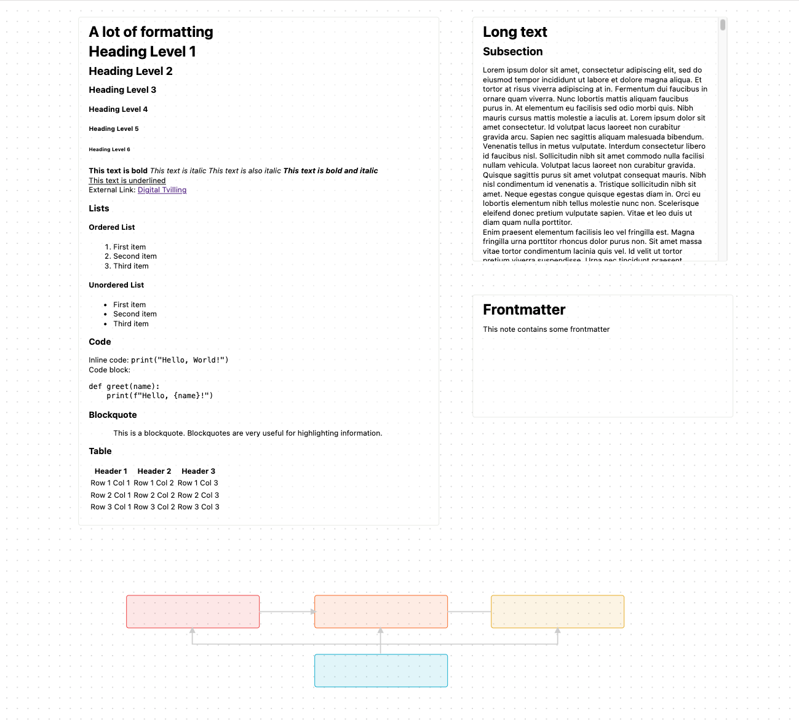

# react-jsoncanvas

A React application that renders data from the JSON Canvas format. For more information about
JSON Canvas, visit [jsoncanvas.org](https://jsoncanvas.org).

## What is react-jsoncanvas?

`react-jsoncanvas` is a React application designed to facilitate the rendering of JSON Canvas files. It provides a set of React components that interpret and display JSON Canvas data in a visual format, in it's current state it is not a library, rather an example/some code to use to render a canvas with nodes and edges in .canvas format

## Features

- It aims to be lightweight and easy to integrate with React projects.
- Provides basic structures and components for rendering JSON Canvas.



## Current state/todo/needed

React for rendering components and [D3](https://d3js.org) for handling zoom and drag/drop in canvas functionality is core in this implementation, and for now react-markdown is being used to render html from markdown.

A lot of functionality and logic is taken from the [jsoncanvas](https://github.com/obsidianmd/jsoncanvas) repository and is being refactored to align more with React standards.

Current focus is as a jsoncanvas viewer/reader

## How to Use

Copy/Paste the features/behaviour you need or follow steps below:

#### As a standalone Application

To get started with `react-jsoncanvas`, clone the repository with

```sh
git clone https://github.com/Digital-Tvilling/react-jsoncanvas.git
```

Install the dependencies with NPM

```sh
npm install
```

Start up the development environment

```sh
npm run dev
```

#### As a dependency (Experimental)
You can also import it in your project and use it as local dependency however it will likely only work in a development environment and fail the build process.

First clone the repository (As it's not available on NPM), ideally in your project root folder.
```sh
git clone https://github.com/Digital-Tvilling/react-jsoncanvas.git
```

You can install the library with a standard install command, but with providing the path to the library folder.

```sh
npm install ./react-jsoncanvas
```

You should now be able to see the module imported as a local dependency in your project package.json
```json
"react-jsoncanvas": "file:react-jsoncanvas"
```
And be able to use it as any library, eg :
```
import { CanvasContent, Canvas, Node, Edge } from 'react-jsoncanvas'
```

## How to Contribute

Contributions are welcome! If you're interested in improving `react-jsoncanvas`, feel free to submit pull requests.

## License

`react-jsoncanvas` is MIT licensed. For more details, see the LICENSE file in the repository.
